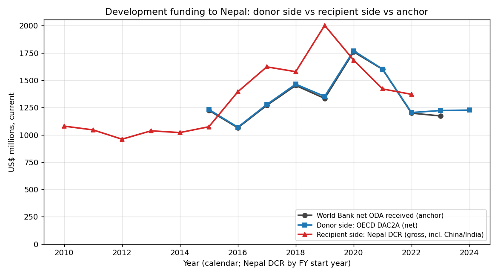
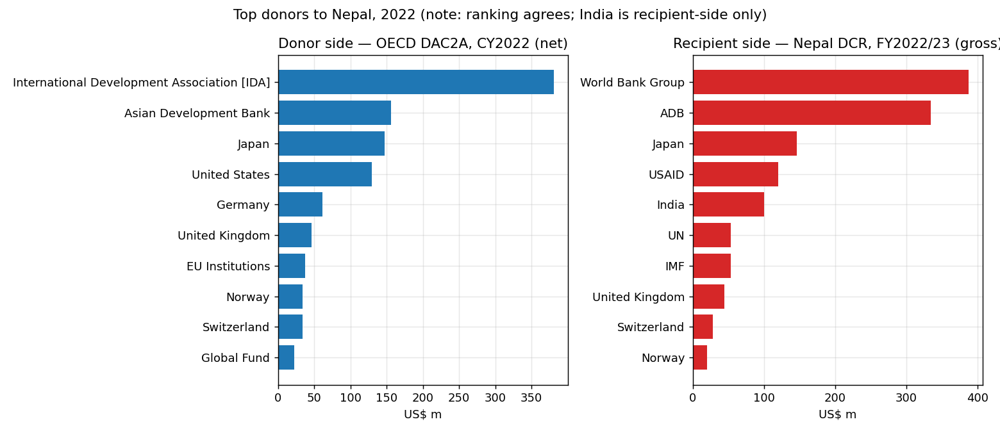
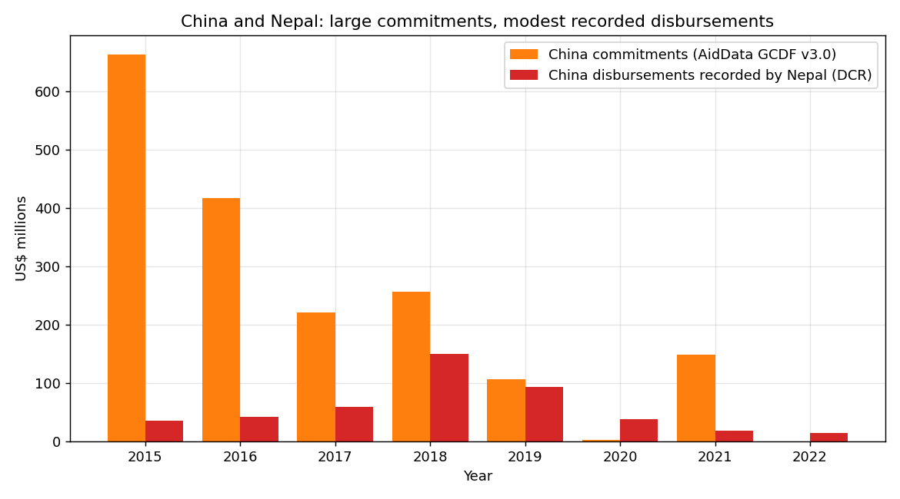
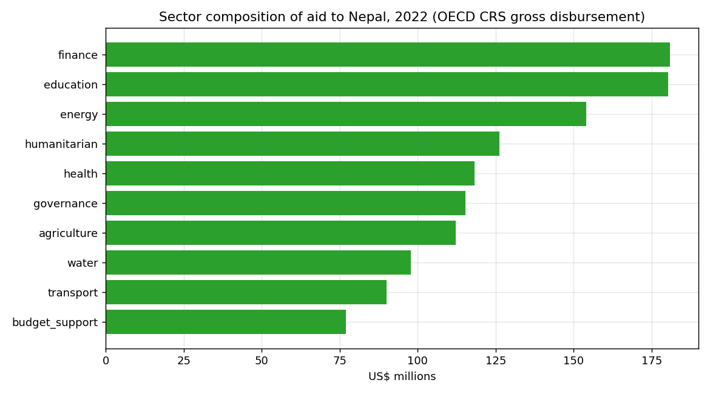
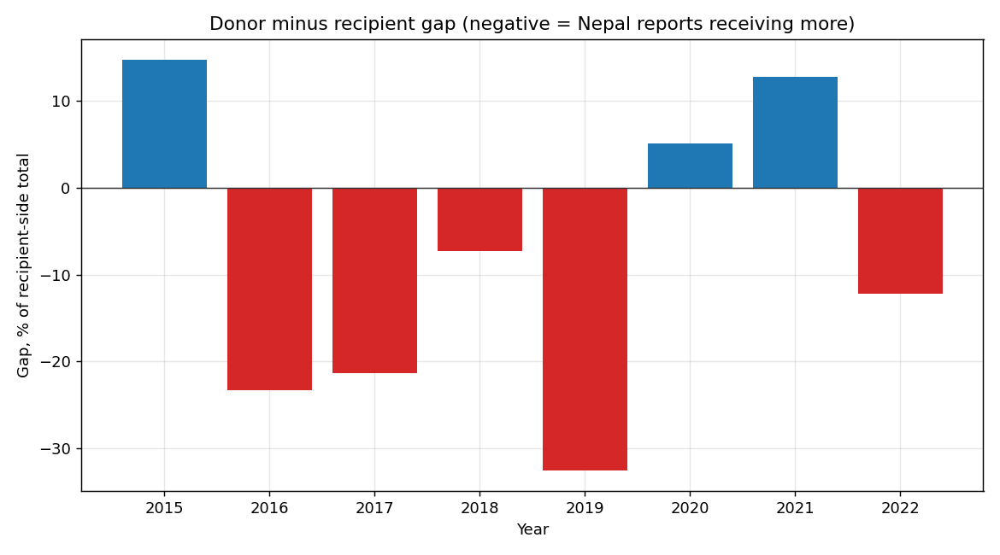
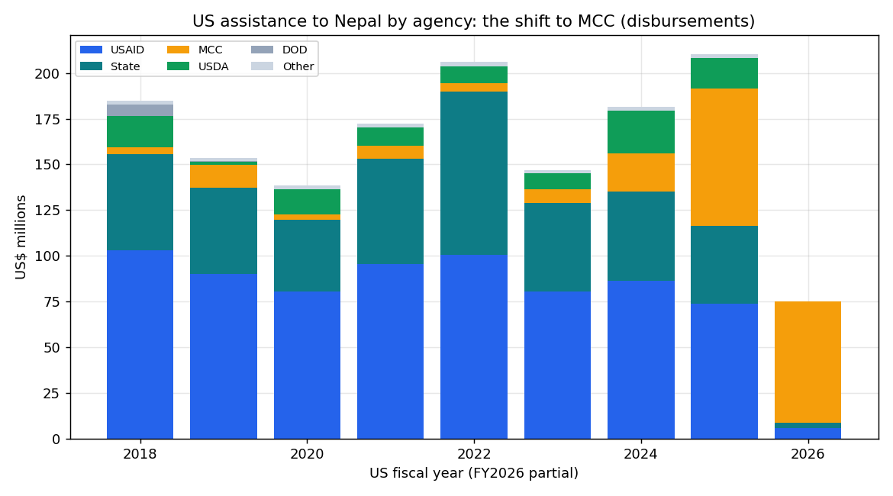

# External Development Funding to Nepal: a verifiable, fully sourced dataset

Retrieval date for all figures: **2026-06-03 (UTC)**. Recipient country: Nepal (ISO-2 NP,
ISO-3 NPL). Primary measure: current (nominal) US dollars unless stated. This report leads
with what is verified, is explicit about what is uncertain, and never presents an estimate
as a confirmed fact. Every quantitative claim links to a working source.

An interactive, self-contained dashboard of these findings is in
[`report/dashboard/index.html`](dashboard/index.html) (run `make serve`, then open
http://127.0.0.1:8848).

## What is verified (read this first)

1. **The donor-side headline reconciles across two independent OECD-rooted sources and an
   internal cross-check.** Net ODA received by Nepal was about **US$1.17 billion in 2023**
   and peaked at **US$1.76 billion in 2020**. The World Bank net-ODA series
   ([DT.ODA.ODAT.CD](https://api.worldbank.org/v2/country/NPL/indicator/DT.ODA.ODAT.CD?format=json&date=2015:2024&per_page=100))
   and the OECD DAC2A "Official donors" aggregate match to the dollar for 2015-2022, and the
   sum of individual (leaf) donors in OECD DAC2A reproduces that total to within ~1%. Status:
   REPORTED, confidence high.

2. **The recipient-side total is internally consistent and independently sourced.** Nepal's
   Ministry of Finance Development Cooperation Report (DCR) FY2022/23 reports total ODA
   disbursement of **US$1.371 billion** for that fiscal year, and the per-donor figures sum to
   that printed total for every fiscal year FY2010/11-FY2022/23. We verified individual cells
   against the source PDF (India US$99.76m, China US$14.45m, World Bank US$387.40m, total
   US$1,371,049,821 all match exactly). Status: REPORTED, confidence low-to-medium (PDF
   extraction, single edition).

3. **Donor-side and recipient-side are compared, never merged.** They differ by -33% to +15%
   year to year. The gap is real and explained below (gross vs net, China/India/Gulf coverage,
   fiscal-year basis, classification). See the Discrepancy Log.

4. **The largest partners for Nepal are the World Bank (IDA) and the Asian Development Bank,
   then Japan, the United States, the United Kingdom and the EU; India is the largest bilateral
   donor that OECD does not capture.** Both ledger sides agree on this ranking.

What is **missing or weak**: China's recent flows (AidData ends ~2021; Nepal's DCR records only
modest Chinese *disbursements*); Gulf/Arab funds (Saudi, Kuwait, OPEC) are visible only in
Nepal's DCR and not itemised elsewhere; the DCR is a single edition (FY2022/23), so FY2023/24
onward is not yet captured; the 2025 US restructuring shows up as a ~74% fall in new US
obligations (to about US$56m in FY2025) while pipeline disbursements held near US$210m. IATI
activity-level data is included as an inventory only and is not summed.

---

## 1. Source Registry

All sources retrieved 2026-06-03. Snapshots and SHA-256 checksums are in
[`data/manifest.csv`](../data/manifest.csv). Full machine-readable registry:
[`config/sources.yaml`](../config/sources.yaml).

| Source | Side | Access method (verified) | Coverage | Status / limitations |
|---|---|---|---|---|
| OECD DAC2A | donor | SDMX-CSV via curl + browser UA. WebFetch is 403-blocked; curl works. [endpoint](https://sdmx.oecd.org/public/rest/data/OECD.DCD.FSD,DSD_DAC2@DF_DAC2A,/.NPL...?startPeriod=2015&endPeriod=2024&dimensionAtObservation=AllDimensions) | 2015-2024 | Mixes aggregate donors + duplicate agency codes; both price bases returned. Handled. |
| World Bank Indicators | donor (OECD-derived) | REST JSON. [endpoint](https://api.worldbank.org/v2/country/NPL/indicator/DT.ODA.ODAT.CD?format=json&date=2015:2024&per_page=100) | 2015-2023 | Net ODA received total; the anchor benchmark. |
| OECD CRS | donor | SDMX-CSV on the **dcd-public** node (the standard node 500s for CRS). [endpoint](https://sdmx.oecd.org/dcd-public/rest/data/OECD.DCD.FSD,DSD_CRS@DF_CRS,/.NPL...) | 2015-2024 | Instrument + sector authority. Excludes non-DAC donors. Carries an `all_sectors` total row (excluded from sums). |
| World Bank Projects | donor | REST JSON. [endpoint](https://search.worldbank.org/api/v3/projects?format=json&countrycode_exact=NP&rows=500) | 1988-2027 | Commitments (board approvals), not disbursements. |
| IATI (d-portal) | donor | No-key activity query. [endpoint](http://d-portal.org/q?from=act&country_code=NP&form=json&limit=500&offset=0) | activity-level | No native USD (FX-converted, ESTIMATED); year is a start-date proxy; multi-country activities inflate totals. Inventory only, not summed. |
| ADB IATI | donor | XML, reporting-org XM-DAC-46004. [file](https://www.adb.org/iati/iati-activities-np.xml) | 2015-2026 | Excludes Technical Assistance Special Fund (undercount). data.adb.org portal is 403-blocked. |
| US ForeignAssistance.gov | donor | Official data-api behind the country page. [endpoint](https://foreignassistance.gov/data-api/by-usg-sector.json?country_code=NPL); [page](https://foreignassistance.gov/cd/nepal) | FY2001-FY2026 | US fiscal year. Obligations + disbursements (budget/appropriation types excluded). Counts all US assistance, broader than ODA. |
| Nepal MoF DCR | **recipient** | PDF, Annex A + B. [IECCD page](https://mof.gov.np/divisions/ieccd/category/dcr/); [FY2022/23 PDF](https://giwmscdntwo.gov.np/media/pdf_upload/DCR%20Report%202022_23_pt2fped.pdf) | FY2010/11-FY2022/23 | Includes China and India. Single edition obtainable; listing page is a JS SPA. Nepal FY = mid-July to mid-July. |
| AidData GCDF v3.0 | donor (non-DAC) | Bulk dataset, filtered to Nepal. [dataset](https://www.aiddata.org/data/aiddatas-geospatial-global-chinese-development-finance-dataset-version-3-0) | 2000-2021 | China finance. Commitments (mostly), lags ~4 years. |

---

## 2. Agency Registry

Type, identifiers, and data availability. Full crosswalk:
[`config/donor_crosswalk.csv`](../config/donor_crosswalk.csv). In current OECD SDMX the donor
code is ISO-3 alpha for bilaterals and an OECD agency code for multilaterals (shown below).

| Donor | Type | OECD code | IATI org id | Data availability for Nepal |
|---|---|---|---|---|
| World Bank / IDA | multilateral | 5WB002 (IDA) | 44000 | OECD DAC2A/CRS, WB Projects, WB Indicators, DCR. Largest partner. |
| Asian Development Bank | multilateral | 5ASDB0 | XM-DAC-46004 | OECD, ADB IATI, DCR. Second largest. TASF excluded from IATI. |
| EU Institutions | multilateral | 4EU001 | XI-IATI-EC | OECD (distinct from member states), DCR. |
| IMF | multilateral | 5IMF02 (concessional trust) | - | OECD, DCR. |
| United States | bilateral (DAC) | USA | US-GOV | OECD, CRS, official ForeignAssistance.gov (FY2001-FY2026), DCR (as USAID). |
| Japan | bilateral (DAC) | JPN | XM-DAC-701 | OECD, CRS, IATI, DCR. |
| United Kingdom | bilateral (DAC) | GBR | GB-GOV-1 | OECD, CRS, IATI, DCR. |
| Germany | bilateral (DAC) | DEU | XM-DAC-5 | OECD, CRS, DCR. |
| Switzerland, Norway, others | bilateral (DAC) | CHE, NOR, ... | various | OECD, CRS, DCR. |
| Global Fund, Gavi, GCF | vertical fund | 9OTH012/009/015 | various | OECD, CRS, DCR. |
| **India** | bilateral (non-DAC) | - | - | **Recipient-side only (DCR)**. Not in OECD CRS. Largest non-DAC bilateral. |
| **China** | bilateral (non-DAC) | - | - | **DCR (modest disbursements) + AidData (commitments, to 2021)**. Not in OECD CRS. |
| Saudi Fund, Kuwait Fund (KFAED), OPEC Fund (OFID) | non-DAC | - | - | **Recipient-side only (DCR)**, not itemised elsewhere. |

---

## 3. Headline Flows to Nepal

### 3a. Net ODA received, donor side, current US$ (the anchor)

Two independent series and the leaf-donor sum, all OECD-rooted. CONSISTENT (agree within 5%).

| Year | World Bank net ODA received | OECD DAC2A "Official donors" | OECD DAC2A leaf-donor sum |
|---:|---:|---:|---:|
| 2015 | 1,224.4 | 1,224.4 | 1,231.9 |
| 2016 | 1,064.5 | 1,064.5 | 1,069.8 |
| 2017 | 1,269.6 | 1,269.6 | 1,277.6 |
| 2018 | 1,452.4 | 1,452.4 | 1,463.7 |
| 2019 | 1,333.6 | 1,333.6 | 1,352.3 |
| 2020 | 1,760.1 | 1,760.1 | 1,770.0 |
| 2021 | 1,599.9 | 1,599.9 | 1,601.9 |
| 2022 | 1,198.7 | 1,198.7 | 1,204.1 |
| 2023 | 1,173.1 | 1,214.4 | 1,222.7 |
| 2024 | n/a | 1,215.2 | 1,226.7 |

Units: US$ millions, current. Sources: [World Bank DT.ODA.ODAT.CD](https://api.worldbank.org/v2/country/NPL/indicator/DT.ODA.ODAT.CD?format=json&date=2015:2024&per_page=100);
OECD DAC2A measure 206 via [SDMX](https://sdmx.oecd.org/public/rest/data/OECD.DCD.FSD,DSD_DAC2@DF_DAC2A,/.NPL...?startPeriod=2015&endPeriod=2024&dimensionAtObservation=AllDimensions).
The 2023 World Bank value is a slightly earlier vintage than OECD's (3.5% lower); logged below.

### 3b. Donor side vs recipient side, total disbursement, by year

| Year (calendar / Nepal FY start) | Donor side, OECD net (US$ m) | Recipient side, Nepal DCR (US$ m) | Gap (donor − recipient) |
|---:|---:|---:|---:|
| 2015 | 1,231.9 | 1,074.1 | +14.7% |
| 2016 | 1,069.8 | 1,394.6 | -23.3% |
| 2017 | 1,277.6 | 1,622.8 | -21.3% |
| 2018 | 1,463.7 | 1,578.5 | -7.3% |
| 2019 | 1,352.3 | 2,002.8 | -32.5% |
| 2020 | 1,770.0 | 1,684.7 | +5.1% |
| 2021 | 1,601.9 | 1,420.5 | +12.8% |
| 2022 | 1,204.1 | 1,371.0 | -12.2% |

Negative = Nepal reports receiving more than OECD donors report giving (net). Donor side =
OECD DAC2A leaf donors (calendar year, net). Recipient side = Nepal DCR per-donor total
(Nepal fiscal year, gross, includes China/India/Gulf). Aligned approximately by the calendar
year the Nepal FY starts; the bases differ. Full table:
[`data/processed/reconciliation_donor_vs_recipient.csv`](../data/processed/reconciliation_donor_vs_recipient.csv).

### 3c. Top donors, 2022, disbursement, current US$ m

| Donor-side (OECD DAC2A net, CY2022) | US$ m | Recipient-side (Nepal DCR, FY2022/23) | US$ m |
|---|---:|---|---:|
| World Bank (IDA) | 380.8 | World Bank Group | 387.4 |
| Asian Development Bank | 155.9 | Asian Development Bank | 334.4 |
| Japan | 146.7 | Japan | 146.2 |
| United States | 129.0 | USAID | 120.2 |
| Germany | 60.9 | **India** | 99.8 |
| United Kingdom | 45.9 | UN agencies | 53.6 |
| EU Institutions | 37.1 | IMF | 52.8 |
| Norway | 33.9 | United Kingdom | 44.4 |
| Switzerland | 33.4 | Switzerland | 28.1 |
| Global Fund | 22.7 | Norway | 20.3 |

Sources: [`data/processed/agg_by_donor_year.csv`](../data/processed/agg_by_donor_year.csv),
built from OECD DAC2A and the Nepal DCR FY2022/23 PDF (verified against the source). India
(US$99.8m, "third-largest bilateral donor" per the DCR narrative) does not appear on the OECD
donor side because it is a non-DAC donor. The ADB figure is far higher on the recipient side
because Nepal records gross loan disbursement while OECD net nets out repayments (see log).

### 3d. Sector composition, 2022, OECD CRS gross disbursement, current US$ m

| Sector | US$ m | Sector | US$ m |
|---|---:|---|---:|
| Banking & finance | 180.9 | Governance | 115.2 |
| Education | 180.4 | Agriculture | 112.2 |
| Energy | 154.1 | Water & sanitation | 97.7 |
| Humanitarian | 126.1 | Health | 118.2 |

Source: [`data/processed/agg_by_sector_year.csv`](../data/processed/agg_by_sector_year.csv)
from OECD CRS via [SDMX dcd-public](https://sdmx.oecd.org/dcd-public/rest/data/OECD.DCD.FSD,DSD_CRS@DF_CRS,/.NPL...).
These are gross figures (CRS total disbursement runs 1.12-1.30x the DAC2A net series).

### 3e. Commitments (kept separate from disbursements, never added)

World Bank new commitments to Nepal (board approvals), [WB Projects API](https://search.worldbank.org/api/v3/projects?format=json&countrycode_exact=NP&rows=500):
2020 US$1,374.7m, 2022 US$687.6m, 2024 US$546.6m. ADB IATI outgoing commitments 2015-2024
total ~US$4.85bn. These are commitment-stage and are reported separately from the
disbursement series above.

### 3f. Figures

Generated by [`scripts/80_figures.py`](../scripts/80_figures.py) from the processed series.

**Donor side vs recipient side vs anchor.** The OECD donor line and the World Bank anchor
overlap to the dollar; Nepal's own reporting (DCR) runs higher in 2016-2019 and peaks at
US$2.0bn in 2019.



**Top donors, 2022.** The ranking agrees across both ledgers. India appears only on the
recipient side (it is a non-DAC donor), and ADB is far larger on the recipient side because
Nepal records gross loan disbursement.



**China: commitments vs recorded disbursements.** AidData commitments (orange) dwarf the
disbursements Nepal actually records (red), the clearest illustration that China's headline
numbers for Nepal are pledges, much of them slow- or un-disbursed.



**Sector composition, 2022 (OECD CRS gross).**



**Donor minus recipient gap.** Negative bars are years Nepal reports receiving more than OECD
donors report giving (net).



**US assistance by agency.** From the official ForeignAssistance.gov data-api. As USAID and State
disbursements fall after FY2024 (and collapse in the partial FY2026), the Millennium Challenge
Corporation compact becomes the dominant US channel.



---

## 4. Discrepancy Log

Every material mismatch found, with magnitude and most likely cause.

| # | Comparison | Magnitude | Most likely cause |
|---|---|---|---|
| D1 | OECD DAC2A "Official donors" vs World Bank net ODA, 2023 | OECD US$1,214m vs WB US$1,173m, +3.5% | Data vintage: the World Bank series is an earlier OECD snapshot. CONSISTENT (within 5%). |
| D2 | OECD DAC2A leaf-donor sum vs "Official donors" total | +0.1% to +1.4% | Non-DAC and private donors not fully itemised at leaf level; rounding. |
| D3 | Donor side (OECD net) vs recipient side (Nepal DCR) | -33% to +15% by year | (a) DCR is gross, OECD is net of loan repayments; (b) DCR includes China, India and Gulf funds that OECD omits; (c) Nepal fiscal year vs calendar year; (d) on/off-budget and classification differences. |
| D4 | OECD CRS gross vs OECD DAC2A net, all donors | CRS 1.12-1.30x DAC2A | Expected: CRS is gross disbursement by activity; DAC2A net deducts loan principal repayments. |
| D5 | ADB: OECD net vs ADB IATI gross vs DCR, 2022 | US$155.9m / US$196.1m / US$334.4m | DAC2A is net concessional; ADB IATI is gross and excludes the TA Special Fund; DCR records gross loan disbursement including non-concessional. |
| D6 | United States: official ForeignAssistance.gov (FY) vs OECD ODA (CY), 2022 | disbursement US$206.0m vs OECD ODA ~US$130m | ForeignAssistance.gov counts ALL US assistance (incl. non-ODA) on a fiscal year; OECD counts ODA only on a calendar year. New US obligations fell ~74% (to ~US$56m) in FY2025 with the 2025 restructuring, while disbursements held at ~US$210m; FY2023 obligations had spiked to ~US$696m on the MCC compact. |
| D7 | China: Nepal DCR disbursement vs AidData commitments | DCR US$150m (2018) falling to US$14m (2022); AidData commitments US$256m (2018), then tapering, data ends 2021 | China's large headline numbers for Nepal are commitments/pledges (e.g. infrastructure loans), much of it slow-disbursing or undisbursed. Recorded Chinese *disbursements* to Nepal are modest and declined sharply after 2018. |
| D8 | India | US$99.8m recipient side (DCR FY2022/23); absent on OECD donor side | India is a non-DAC donor and does not report to the OECD CRS. Recipient-side reporting is the only systematic capture. |
| D9 | World Bank/IDA: OECD net vs DCR | 2022 US$380.8m vs US$387.4m (+1.7%); 2018 US$545.1m vs US$528.3m | Close agreement: both are essentially gross IDA disbursement; small timing/FY differences. |

---

## 5. Methodology and Limitations

**Commitments vs disbursements.** Held separate by construction: `flow_stage` is part of the
primary key and no aggregate ever mixes them. The headline series is disbursements; commitments
are reported as a parallel series.

**Currency and prices.** Primary measure is current (nominal) US$ in `amount_usd`. OECD
constant-price (base 2024) figures are kept in `amount_usd_constant`. The original currency is
retained. IATI d-portal has no native USD, so its amounts are converted from the EUR figures
using ECB annual-average EUR/USD rates ([`config/fx_rates.csv`](../config/fx_rates.csv)) and
flagged `status=ESTIMATED`. No figure is silently converted.

**Fiscal years.** No money is reallocated across periods. Every row carries `fiscal_basis`
(nepal_fy / donor_fy / calendar) and explicit Gregorian `period_start`/`period_end`. Nepal's
fiscal year (mid-July to mid-July, Bikram Sambat) is mapped in
[`config/fy_calendar.csv`](../config/fy_calendar.csv). Donor-vs-recipient comparisons align by
the calendar year the Nepal FY starts and are labelled approximate.

**Double counting.** Three firewalls: (1) the OECD donor dimension is a hierarchy, so ~17
aggregate and duplicate codes (Official donors, Multilaterals, DAC, G7, World Bank = IDA = World
Bank Group, ADB listed twice, IMF twice) are excluded from the leaf breakdown; (2) IATI is
deduplicated by iati-identifier; (3) the headline rule: the donor-side headline is **only** OECD
DAC2A and the recipient-side headline is **only** the Nepal DCR (the two are compared, never
summed), and every other donor source is `counts_in_headline=False` detail. A bilateral's core
contribution to a multilateral is never added to that multilateral's disbursement to Nepal: the
dataset counts observed multilateral-to-Nepal flows, not imputed shares.

**Non-DAC donors.** China, India and the Gulf/Arab funds are absent from OECD CRS. They are
captured from Nepal's DCR (recipient side) and, for China, supplemented by AidData. India is the
largest of these (US$99.8m disbursed FY2022/23).

**What we could not verify or obtain.** Only the FY2022/23 DCR PDF was retrievable (the IECCD
listing page is a JavaScript single-page app and other editions returned 404), so FY2023/24
onward is not captured (a FY2023/24 report is referenced online at ~US$2.5bn committed / ~US$1.58bn
disbursed but no PDF could be located). US data now comes from the official ForeignAssistance.gov
data-api (FY2001-FY2026); the 2025 restructuring is visible as a sharp fall in new obligations
while disbursements still flow from the existing pipeline. AidData's China coverage ends ~2021. The EU "Team Europe
Explorer" exposes no API and was not machine-ingested (EU Institutions are covered via OECD).
IATI d-portal activity data is an inventory only (no native USD, activity-level year proxy,
multi-country activities inflate totals) and is excluded from all sums.

**Confidence.** High: OECD DAC2A, World Bank Indicators (structured APIs, native USD,
reconciled). Medium: OECD CRS, WB Projects, ADB IATI, US (structured but gross/FX/FY transforms
or volatility). Low: Nepal DCR (PDF extraction, verified but single edition), AidData (lagged),
IATI d-portal (estimated, proxy year).

---

## 6. Data Dictionary

Full machine-readable definitions for every field and code:
[`data/processed/data_dictionary.json`](../data/processed/data_dictionary.json). Key fields:
`side` (donor/recipient), `flow_stage` (commitment/disbursement), `instrument`
(grant/concessional_loan/oof/other), `amount_usd` (absolute current USD, primary),
`amount_usd_constant` (base-2024 where available), `fiscal_basis`, `period_start/end`, `status`
(REPORTED/ESTIMATED/MISSING), `confidence`, `counts_in_headline` (the non-double-counted set for
its side), `is_multilateral_outflow`, `source_url`, `retrieved_at`. Sector and donor crosswalks
are in [`config/`](../config/).

---

## 7. Reproducibility Appendix

Tools: Python 3.13 (pandas, requests), curl. Build:

```bash
pip install -r requirements.txt
make anchor    # World Bank net-ODA anchor + OECD DAC2A (verified core)
make fetch     # remaining donor sources (also runnable via the parallel agent workflow)
make build     # dedupe IATI, reconcile, assemble core_long + aggregates + data dictionary
make validate  # integrity assertions (exits non-zero on failure)
```

Exact endpoints, dataset versions, HTTP status, byte sizes, SHA-256 and retrieval timestamps for
every snapshot are in [`data/manifest.csv`](../data/manifest.csv). Dataflow versions:
OECD DAC2A `DSD_DAC2@DF_DAC2A` v1.5; OECD CRS `DSD_CRS@DF_CRS` (dcd-public node); World Bank
Projects API v3; World Bank Indicators API v2. Recipient code in current OECD SDMX is the ISO-3
string `NPL` (the legacy numeric DAC code 547 applies only to old CRS bulk microdata files).
Snapshots are immutable; the irreplaceable Nepal DCR PDF and the OECD/ADB anchor snapshots are
committed to git, while large regenerable raw blobs (US, CRS, IATI, AidData) are git-ignored but
fully reproducible from the documented queries and verifiable against the manifest SHA-256 hashes.

Notable reproducibility facts discovered during the build: OECD SDMX returns HTTP 403 to the
default fetch agent but 200 to a browser User-Agent over curl; the CRS flow returns HTTP 500 on
the standard `sdmx.oecd.org/public/rest` node and must be queried on `sdmx.oecd.org/dcd-public`;
d-portal's `select=stats` form is broken and the `from=act` form must be used.

---

## 8. Machine-readable output

| File | Contents |
|---|---|
| [`data/processed/core_long.csv`](../data/processed/core_long.csv) | full canonical table, 76,158 rows, 9 sources |
| [`data/processed/core_long.json`](../data/processed/core_long.json) | same, JSON records |
| [`data/processed/core_headline.csv`](../data/processed/core_headline.csv) | slim headline-only series (982 rows: 686 donor-side OECD + 296 recipient-side DCR) |
| [`data/processed/agg_by_donor_year.csv`](../data/processed/agg_by_donor_year.csv) | headline donor and recipient totals by year and flow stage |
| [`data/processed/agg_by_sector_year.csv`](../data/processed/agg_by_sector_year.csv) | sector composition (OECD CRS, plus US mapped from USG categories) |
| [`data/processed/us_by_agency.csv`](../data/processed/us_by_agency.csv) | US assistance by funding agency and year (official ForeignAssistance.gov; alternative cut of the US totals, not additive with the sector view) |
| [`data/processed/us_by_account.csv`](../data/processed/us_by_account.csv) | US assistance by funding agency and named budget account (52 accounts), FY2001-FY2026, current + constant-2024 USD |
| [`data/processed/us_by_usg_sector_detail.csv`](../data/processed/us_by_usg_sector_detail.csv) | US assistance by USG category and sub-sector (~50 programs), FY2001-FY2026 |
| [`data/processed/us_by_managing_agency.csv`](../data/processed/us_by_managing_agency.csv) | US assistance by implementing (managing) agency; reconciles to the funding-agency cut to the dollar |
| [`data/processed/us_project_detail.csv`](../data/processed/us_project_detail.csv) | per-project obligation/outlay/sub-award totals for the 154 awards >= $1m (USASpending) |
| [`data/processed/us_subawards.csv`](../data/processed/us_subawards.csv) | 1,626 sub-awards to 562 organisations beneath the US primes, with Nepal district where named |
| [`data/processed/documents.csv`](../data/processed/documents.csv) | archived primary strategy/compact documents (MCC, CDCS, ICS, ADB CPS, WB CPF) with SHA-256 |
| [`data/processed/audits.csv`](../data/processed/audits.csv) | USAID OIG Nepal audits: questioned costs, verdict, archived-or-not, verified-in-PDF (oig.usaid.gov) |
| [`data/processed/us_partners.csv`](../data/processed/us_partners.csv) | top US implementing partners for Nepal (USASpending.gov awards, obligations, place of performance NPL; separate accounting frame, not additive with the above) |
| [`data/processed/us_awards.csv`](../data/processed/us_awards.csv) | largest named US awards for Nepal with official descriptions, periods, awarding agencies and award links (USASpending.gov) |
| [`data/processed/documents.csv`](../data/processed/documents.csv) | registry of archived primary documents (MCC compact agreement, USAID CDCS 2020-25 recovered from grants.gov, US ICS, ADB CPS 2025-29, WB CPF FY2025-31) with SHA-256, page counts and original URLs; PDFs in `data/raw/docs/`, extracted text in `data/interim/docs/` |
| [`data/processed/us_projects_all.csv`](../data/processed/us_projects_all.csv) | the FULL US project ledger: all 2,609 awards implemented in Nepal FY2015-26 (USASpending), each triaged completed / active / ended-in-2025-26-window / undated, with description, period, agency and award link |
| [`data/processed/reconciliation_donor_vs_recipient.csv`](../data/processed/reconciliation_donor_vs_recipient.csv) | per-year donor vs recipient vs anchor, gaps |
| [`data/processed/coverage_matrix.csv`](../data/processed/coverage_matrix.csv) | which donors appear donor-side, recipient-side, or both |
| [`data/processed/data_dictionary.json`](../data/processed/data_dictionary.json) | field and code definitions |

Schema columns: `obs_id, side, source, source_record_id, donor_name, donor_dac_code,
donor_iati_id, recipient, sector, sector_raw, flow_stage, instrument, amount_usd,
amount_usd_constant, price_base_year, amount_original, currency_original, price_base, year,
fiscal_basis, period_start, period_end, status, confidence, dataset_version, dedup_key,
is_multilateral_outflow, counts_in_headline, source_url, retrieved_at, notes`.
